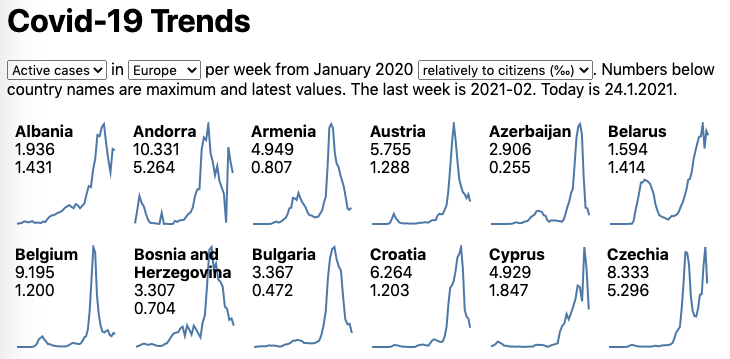

# Covid-19 Brief Trends

Briefly compares trends of active cases and new deaths connected to Covid-19 per week and country. Offers a rough overview of the virus momentum. Uses data from [ECDC]. See the current state [on-line].

## Run

You can run the same service as runs [on-line] on your machine using [Docker] imaghe [prantlf/covid-19-brief].

    docker run --rm -it --name covid-19-brief -e PORT=5000 -p 5000:5000 \
      prantlf/covid-19-brief

## Build

Make sure that you have [Node.js] >= 12 installed. Clone the repository, install the dependencies and start the server. You can use `npm` or `yarn` instead of `pnpm`.

    git clone https://github.com/prantlf/covid-19-brief.git
    cd covid-19-brief
    pnpm i
    node generate

This will generate the home page and graph images. You can open the HTML page `public/index.html` in a web browser.

    PORT=80 npm start

This will update the generated web site, start a web server on the specified port and wait for updates. You can open the HTML page `public/index.html` in a web browser.

You can also build and run the [Docker] image from the local sources using [Make].

    make lint build run

## Contributing

In lieu of a formal styleguide, take care to maintain the existing coding style. Lint your code using `npm test`.

## License

Copyright (c) 2018-2021 Ferdinand Prantl

Licensed under the MIT license.

Icon made by [srip from www.flaticon.com].

[on-line]: https://prantlf.github.io/covid-19-brief
[ECDC]: https://opendata.ecdc.europa.eu/
[Node.js]: https://nodejs.org/
[Docker]: https://www.docker.com/
[Make]: https://www.gnu.org/software/make/
[srip from www.flaticon.com]: https://www.flaticon.com/free-icon/coronavirus_2833315
[prantlf/covid-19-brief]: https://hub.docker.com/repository/docker/prantlf/covid-19-brief
